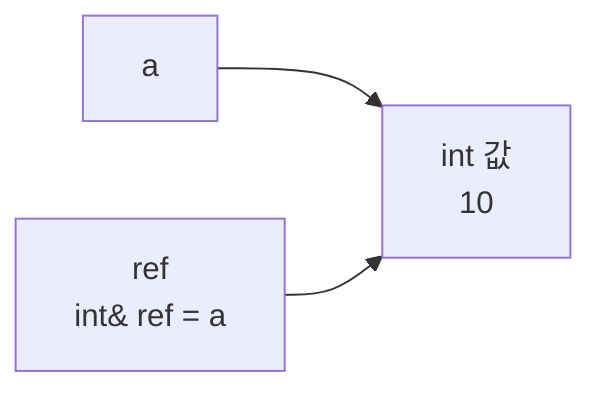
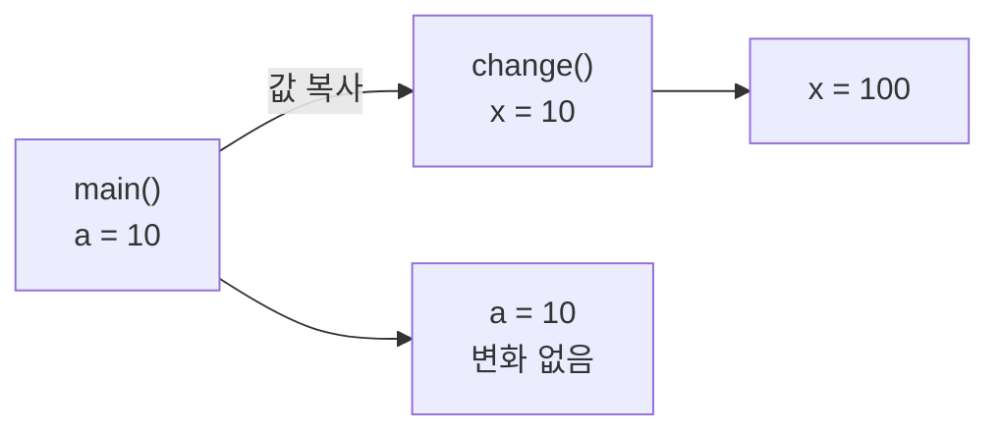
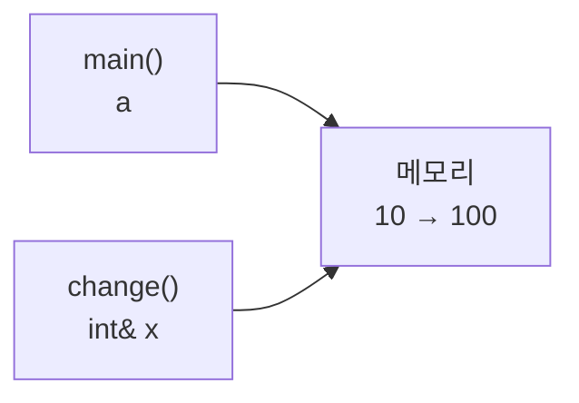
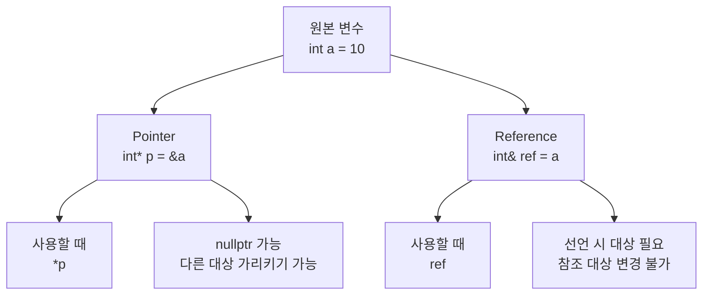
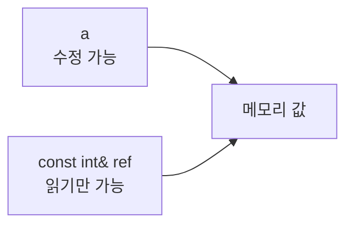
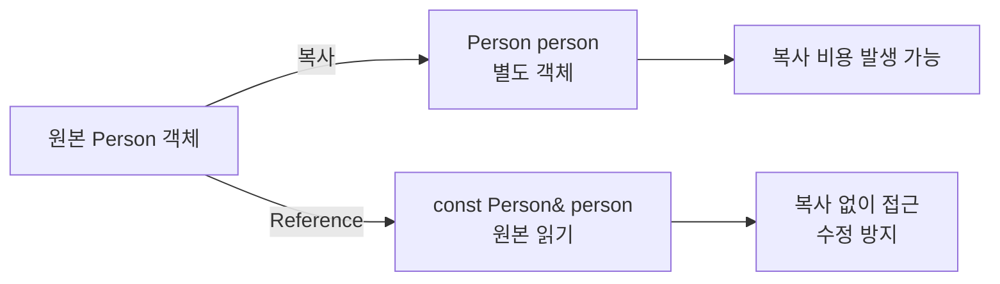
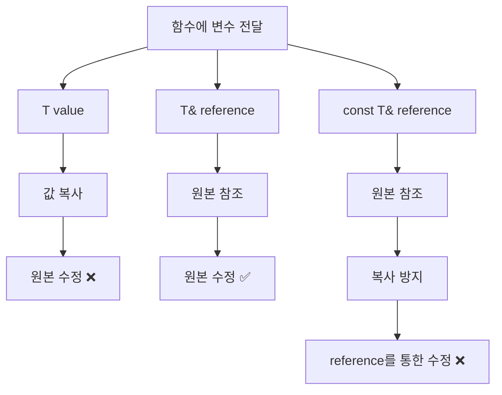
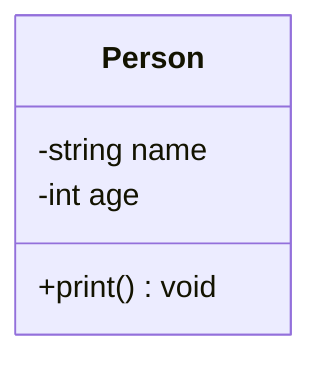
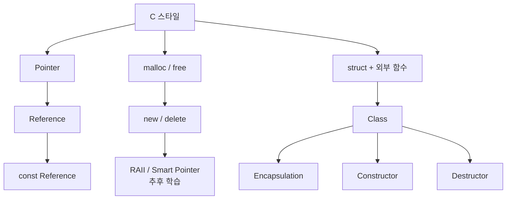
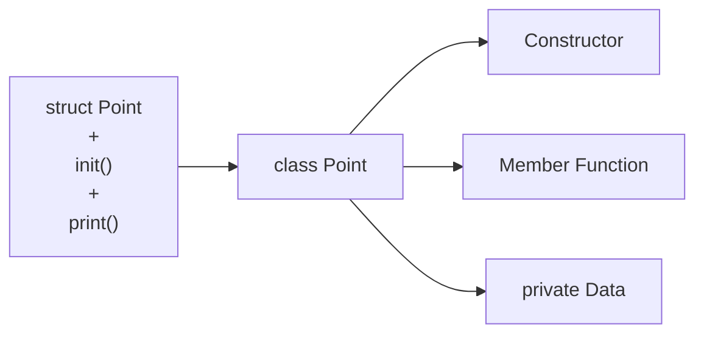

# Podcast 01 — C에서 C++로: Reference와 메모리

- [팟캐스트 링크](https://notebook.google.com/notebook/7c192b19-7039-4a6f-91df-d5fca478ffb0/artifact/79aef7ed-3f21-4f0d-97c9-47431f50b762?utm_source=nlm_web_share&utm_medium=google_oo&utm_campaign=art_share_1&utm_content=&utm_smc=nlm_web_share_google_oo_art_share_1_)

## 학습 자료

- [C++ 참조자](https://modoocode.com/141)
- [new / delete](https://modoocode.com/169)

# 1. 참조자(Reference)

## 1.1 Reference = 변수의 별명

Reference는 이미 존재하는 변수에 **또 다른 이름을 붙이는 것**이다.

```cpp
int a = 10;
int& ref = a;
```

`ref`라는 새로운 `int` 값이 만들어진 것이 아니라, `ref`가 `a`를 참조한다.



따라서:

```cpp
ref = 20;

std::cout << a;    // 20
std::cout << ref;  // 20
```

`ref`를 변경하면 원본인 `a`가 변경된다.

### Reference의 특징

Reference는 선언과 동시에 참조 대상을 지정해야 한다.

```cpp
int& ref;      // ❌
int& ref = a;  // ✅
```

또한 한 번 정해진 참조 대상을 다른 대상으로 바꿀 수 없다.

```cpp
int a = 10;
int b = 20;

int& ref = a;

ref = b;
```

마지막 줄은 `ref`가 `b`를 참조하게 되는 것이 아니다.

`ref`는 여전히 `a`의 별명이므로 사실상:

```cpp
a = b;
```

가 실행된다.

결과:

```text
a = 20
b = 20

ref → 여전히 a
```

---

# 2. 함수와 Reference

Reference가 특히 유용한 곳이 **함수 인자**다.

## 2.1 Pass by Value

```cpp
void change(int x)
{
    x = 100;
}

int main()
{
    int a = 10;
    change(a);
}
```

함수의 `x`에는 `a`의 **값이 복사**된다.



따라서 함수에서 `x`를 수정해도 원본 `a`에는 영향을 주지 않는다.

---

## 2.2 Pass by Reference

```cpp
void change(int& x)
{
    x = 100;
}

int main()
{
    int a = 10;
    change(a);
}
```

이번에는 `x`가 `a`를 직접 참조한다.



따라서:

```cpp
x = 100;
```

은 사실상 원본 `a`를 수정하는 것이다.

---

# 3. Pointer와 Reference

C에서는 원본 변수를 함수에서 변경하기 위해 포인터를 많이 사용한다.

```cpp
void change(int* x)
{
    *x = 100;
}

int main()
{
    int a = 10;
    change(&a);
}
```

C++ Reference를 사용하면:

```cpp
void change(int& x)
{
    x = 100;
}

int main()
{
    int a = 10;
    change(a);
}
```

처럼 표현할 수 있다.



현재 단계에서는 다음 정도로 구분하면 된다.

| 구분        | Pointer       | Reference      |
| --------- | ------------- | -------------- |
| 선언        | `int* p = &a` | `int& ref = a` |
| 값 접근      | `*p`          | `ref`          |
| 주소 전달     | `func(&a)`    | `func(a)`      |
| `nullptr` | 가능            | 일반적으로 불가       |
| 대상 변경     | 가능            | 불가             |
| 주 용도      | 주소/메모리 직접 조작  | 기존 객체의 별명      |

---

# 4. const

`const`는 해당 이름을 통해 값을 변경하지 못하도록 제한한다.

```cpp
const int a = 10;

a = 20;  // ❌ 컴파일 에러
```

읽는 것은 가능하다.

```cpp
std::cout << a;  // ✅
```

현재는 다음처럼 기억한다.

> **const = 이 이름을 통해 값을 변경하지 않겠다.**

---

# 5. const Reference

C++에서 매우 자주 등장하는 형태다.

```cpp
int a = 10;

const int& ref = a;
```

`ref`는 `a`를 참조하지만 **`ref`를 통해서는 값을 변경할 수 없다.**

```cpp
ref = 20;  // ❌
```

하지만 원본 `a` 자체가 `const`인 것은 아니다.

```cpp
a = 20;    // ✅
```



즉:

```text
int& ref
→ 원본 참조
→ 수정 가능

const int& ref
→ 원본 참조
→ ref를 통한 수정 불가능
```

---

# 6. 함수에서 const Reference

앞으로 C++ 코드에서 다음과 같은 표현을 매우 자주 보게 된다.

```cpp
void print(const Person& person)
{
    // person 정보 출력
}
```

그냥 다음과 같이 받을 수도 있다.

```cpp
void print(Person person)
```

하지만 이것은 객체를 **값으로 전달**하므로 복사가 발생할 수 있다.

반면:

```cpp
void print(const Person& person)
```

은 원본 객체를 참조한다.

동시에 `const`가 있으므로 함수가 해당 reference를 통해 원본을 변경하는 것을 막는다.



### 핵심 패턴

큰 객체를 함수에서 **읽기만 할 때**:

```cpp
const Type& parameter
```

형태를 자주 사용한다.

---

# 7. 함수 인자 한 번에 정리

```cpp
void func(int x);
```

```text
값을 복사해서 받음
원본 수정 ❌
```

```cpp
void func(int& x);
```

```text
원본을 참조
원본 수정 ✅
```

```cpp
void func(const int& x);
```

```text
원본을 참조
x를 통한 원본 수정 ❌
```



---

# 8. new / delete

C에서는 동적 메모리 할당에:

```c
malloc()
free()
```

를 사용한다.

C++에서는:

```cpp
new
delete
```

를 사용할 수 있다.

## 단일 객체

```cpp
int* p = new int;

*p = 10;

delete p;
```

## 배열

```cpp
int* arr = new int[10];

delete[] arr;
```

반드시 짝을 맞춘다.

```text
new     ↔ delete
new[]   ↔ delete[]
```

---

# 9. malloc과 new의 차이

`malloc`은 기본적으로 **메모리 공간을 확보**한다.

클래스 객체를 `new`로 생성하면 메모리를 확보하면서 **생성자까지 호출**한다.

```cpp
Person* p = new Person();
```


그리고:

```cpp
delete p;
```

를 수행하면:


즉:

```text
new
→ 메모리 확보
→ 생성자

delete
→ 소멸자
→ 메모리 해제
```

이 개념은 이후 배우게 될 **RAII와 스마트 포인터**로 연결된다.

---

# 10. 클래스와 캡슐화

클래스는 **데이터(상태)** 와 그 데이터를 다루는 **함수(동작)** 를 하나로 묶는다.

```cpp
class Person
{
private:
    std::string name;
    int age;

public:
    void print();
};
```

## private

클래스 외부에서 직접 접근할 수 없다.

```cpp
person.age = 20;  // ❌
```

## public

외부에서 사용할 수 있다.

```cpp
person.print();   // ✅
```



`-`는 `private`, `+`는 `public`을 의미한다.

내부 데이터를 숨기고 정해진 함수를 통해서만 접근하도록 만드는 것이 **캡슐화(Encapsulation)** 의 기본 개념이다.

---

# 11. 생성자와 소멸자

## 생성자 Constructor

객체가 생성될 때 자동 호출된다.

```cpp
class Person
{
public:
    Person()
    {
        std::cout << "생성";
    }
};
```

특징:

* 클래스와 이름이 같다.
* 반환형이 없다.
* 객체 초기화를 담당한다.

---

## 소멸자 Destructor

객체가 사라질 때 자동 호출된다.

```cpp
~Person()
{
    std::cout << "소멸";
}
```

객체가 사용하던 자원을 정리하는 역할을 한다.


이러한 객체의 **생명주기 관리**가 이후 배우는 RAII의 핵심 기반이 된다.

---

# 12. 초기화 리스트

생성자 본체에서 다음처럼 대입할 수도 있다.

```cpp
Person(std::string n, int a)
{
    name = n;
    age = a;
}
```

하지만 C++에서는 초기화 리스트를 많이 사용한다.

```cpp
Person(std::string n, int a)
    : name(n), age(a)
{
}
```

객체 생성 과정을 개념적으로 보면:


특히 다음과 같은 멤버는 초기화 리스트가 중요하다.

```cpp
const int id;
SomeType& reference;
```

`const` 멤버와 reference 멤버는 생성 후 다른 값을 대입해서 초기 상태를 설정하는 방식이 맞지 않기 때문에 **객체 생성 시점에 초기화해야 한다.**

---

# 13. 이번 Chapter 핵심 구조



---

# 핵심 문법 정리

```cpp
int value;
```

일반 변수.

```cpp
int* pointer;
```

주소를 저장하는 포인터.

```cpp
int& reference = value;
```

기존 변수의 별명.

```cpp
const int& reference = value;
```

기존 변수를 읽기 전용으로 참조.

---

# 연습문제

## 문제 1 — Person 클래스

나이(`int age`)와 이름(`std::string name`)을 멤버 변수로 가지는 `Person` 클래스를 작성한다.

조건:

* 멤버 변수는 `private`
* 생성자에서 **초기화 리스트** 사용
* `void print()` 함수 구현
* 소멸자에서 `"이름님이 소멸되었습니다"` 출력

---

## 문제 2 — C 스타일 리팩토링

다음 C 스타일 코드를 C++ 클래스로 변경한다.

```cpp
struct Point
{
    int x;
    int y;
};

void init(struct Point* p, int _x, int _y)
{
    p->x = _x;
    p->y = _y;
}

void print(struct Point* p)
{
    printf("좌표: (%d, %d)\n", p->x, p->y);
}

int main()
{
    struct Point pt;
    init(&pt, 10, 20);
    print(&pt);
}
```

목표:



---

## 문제 3 — 출력 결과 맞히기

코드를 실행하지 않고 결과를 예상한다.

```cpp
#include <iostream>

void change(int& x)
{
    x = x + 10;
}

int main()
{
    int a = 5;
    int& b = a;

    b = 20;
    change(a);

    std::cout << a << std::endl;
    std::cout << b << std::endl;

    return 0;
}
```

### 질문

1. `a`는 무엇이 출력되는가?
2. `b`는 무엇이 출력되는가?
3. `b`와 `a`는 어떤 관계인가?
4. `change(a)`가 실행될 때 어떤 값이 변경되는가?

---

## 문제 4 — 컴파일 에러 찾기

```cpp
#include <iostream>

int main()
{
    int a = 10;

    int& ref1 = a;
    const int& ref2 = a;

    ref1 = 20;
    ref2 = 30;

    a = 40;

    const int b = 50;
    int& ref3 = b;
    const int& ref4 = b;

    std::cout << ref4 << std::endl;

    return 0;
}
```

다음을 채운다.

| Reference | 참조 대상 | Reference를 통한 수정 | 컴파일 |
| --------- | ----- | ---------------- | --- |
| `ref1`    | ?     | ?                | ?   |
| `ref2`    | ?     | ?                | ?   |
| `ref3`    | ?     | ?                | ?   |
| `ref4`    | ?     | ?                | ?   |

컴파일 에러가 발생하는 줄은 **왜 에러가 발생하는지도 설명한다.**

---

## 한 줄 요약

> **Reference는 기존 객체의 별명이고, `const T&`는 원본을 복사하지 않고 안전하게 읽기 위한 C++의 핵심적인 표현이다.**
