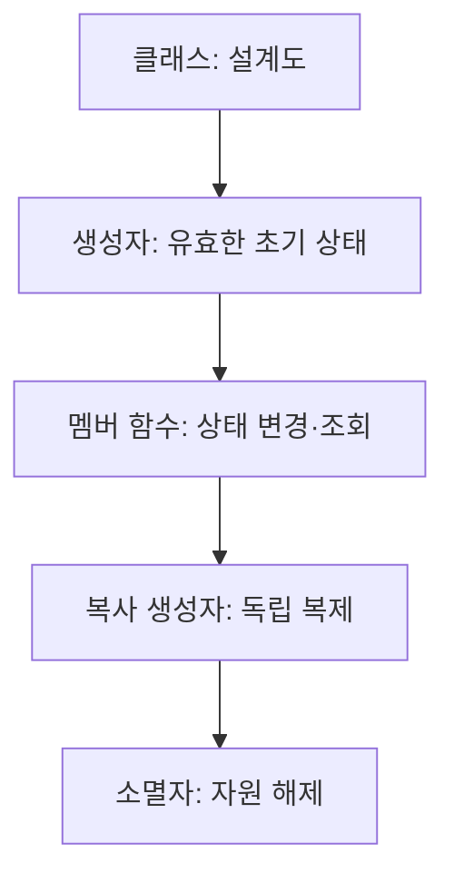
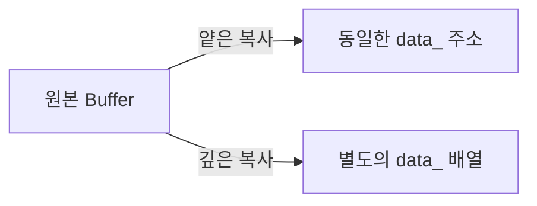

# Podcast 02 — C++ 객체와 클래스: 설계, 수명, 복사

- [팟캐스트 링크](https://notebook.google.com/notebook/7c192b19-7039-4a6f-91df-d5fca478ffb0/artifact/e037d0d5-5c22-4b33-adad-01f9cdb23223?utm_source=nlm_web_share&utm_medium=google_oo&utm_campaign=art_share_1&utm_content=&utm_smc=nlm_web_share_google_oo_art_share_1_)

## 학습 자료

- [4-1. 이 세상은 객체로 이루어져 있다](https://modoocode.com/172)
- [4-2. 클래스의 세계로 오신 것을 환영합니다](https://modoocode.com/173)
- [4-3. 스타크래프트를 만들자 ①](https://modoocode.com/188)
- [4-4. 스타크래프트를 만들자 ②](https://modoocode.com/197)
- [4-5. 내가 만드는 String 클래스](https://modoocode.com/198)
- [4-6. 클래스의 explicit과 mutable 키워드](https://modoocode.com/253)

## 이번 회차의 큰 그림

클래스는 **상태(멤버 변수)**와 그 상태를 안전하게 다루는 **행동(멤버 함수)**을 묶은 설계도다. 이 회차는 `객체 설계 → 생성·소멸 → 복사 → 공유 상태 → 직접 String 구현`의 흐름으로 C++ 클래스의 기초를 완성한다.



## 1. 객체, 클래스, 캡슐화

객체는 현실의 대상을 필요한 정보와 동작으로 추상화한 소프트웨어 단위다. `Animal` 클래스는 `food`, `weight` 같은 상태와 `increase_food()` 같은 동작을 함께 가진다. 클래스는 설계도, 실제로 만들어진 객체는 인스턴스다.

`private` 멤버는 클래스 내부에서만 접근하며, `public` 멤버는 외부 사용자가 호출할 수 있다. 내부 상태를 직접 노출하지 않고 공개된 함수로만 조작하게 하는 것이 **캡슐화**다.

```cpp
#include <iostream>

class FuelTank {
 private:
  int fuel_ = 0;

 public:
  void AddFuel(int amount) {
    if (amount > 0) fuel_ += amount;
  }
  int fuel() const { return fuel_; } //여기서 const 는 멤버함수는 객체의 상태를 바꾸지 않습니다 라느 ㄴ의미
                                     //여기서 fuel은 단순 getter임... 객체의 상태를 바꾸지 않음
};

int main() {
  FuelTank tank;
  tank.AddFuel(20);       // ✅ 의도를 가진 공개 인터페이스
  // tank.fuel_ = -10;    // ❌ private 멤버 직접 접근
  std::cout << tank.fuel() << '\n';
}
```

### 설계 포인트

| 구분 | `public` | `private` |
| --- | --- | --- |
| 역할 | 외부에 약속하는 사용 방법 | 구현 세부사항·불변식 보호 |
| 변경 영향 | 호출자에게 영향 가능 | 내부 개선을 숨길 수 있음 |
| 예 | `AddFuel()`, `fuel()` | `fuel_` |

멤버 변수는 가능한 한 `private`으로 두고, 필요한 행위만 함수로 공개한다. 이는 관급 알고리즘을 래핑할 때도 입력 검증·단위 변환·상태 갱신을 클래스 안에 가둘 수 있어 특히 유용하다.

## 2. 함수 오버로딩과 생성자

### 2.1 함수 오버로딩

같은 이름이라도 **매개변수의 개수 또는 타입**이 다르면 별도의 함수로 정의할 수 있다. 반환형만 다른 함수는 오버로딩할 수 없다.
네임 맹글링
```cpp
#include <iostream>

void Print(int value) { std::cout << "int: " << value << '\n'; }
void Print(double value) { std::cout << "double: " << value << '\n'; }

int main() {
  Print(3);     // Print(int)
  Print(3.14);  // Print(double)
}
```

### 2.2 생성자: 객체를 만들자마자 유효하게

생성자는 클래스 이름과 같고 반환형이 없다. 객체 생성 때 자동 호출되어 멤버를 초기화한다. 초기화가 누락된 객체의 쓰레기값 문제를 막는 첫 방어선이다.

```cpp
class Date {
 private:
  int year_, month_, day_;

 public:
  Date() : year_(2026), month_(1), day_(1) {}  // 기본 생성자
  Date(int year, int month, int day)
      : year_(year), month_(month), day_(day) {}
};

int main() {
  Date today;             // 기본 생성자
  Date wedding(2027, 4, 17);
  // Date mistaken();     // ❌ Date를 반환하는 함수 선언
}
```

생성자에서는 대입보다 **멤버 초기화 리스트**를 우선한다. 특히 `const` 멤버, 참조 멤버, 다른 클래스 타입 멤버는 초기화 리스트가 필수이거나 자연스럽다. C++11부터 기본 생성자를 명시하려면 `Date() = default;`를 쓸 수 있다.

## 3. 객체 수명: 소멸자와 RAII의 출발점

소멸자 `~클래스명()`은 객체의 수명이 끝날 때 자동 호출된다. `new`로 동적 생성한 객체는 `delete`해야 하며, `delete`는 소멸자까지 호출한다.

```cpp
class Buffer {
 private:
  int* data_;
 public:
  Buffer(int size) : data_(new int[size]{}) {}
  ~Buffer() { delete[] data_; }
};
```

이처럼 생성자에서 얻은 자원을 소멸자에서 정리하는 습관이 RAII의 출발점이다. 다만 실무에서는 직접 `new`/`delete`하기보다 `std::vector`, `std::string`, 스마트 포인터를 우선 사용한다.

## 4. 복사 생성자와 깊은 복사

복사 생성자는 새 객체를 기존 객체로부터 만들 때 호출된다. 대표 형태는 `T(const T& other)`다. `const` 참조로 받으면 원본을 바꾸지 않으며 불필요한 복사도 피한다.

```cpp
class Buffer {
 private:
  int size_;
  int* data_;
 public:
  Buffer(int size) : size_(size), data_(new int[size]{}) {}
  Buffer(const Buffer& other) : size_(other.size_), data_(new int[other.size_]) {
    for (int i = 0; i < size_; ++i) data_[i] = other.data_[i];
  }
  ~Buffer() { delete[] data_; }
};
```



- **얕은 복사**: 포인터 주소만 복사한다. 두 객체가 같은 배열을 가리켜 이중 해제·의도치 않은 공유가 발생할 수 있다.
- **깊은 복사**: 새 배열을 할당하고 원소까지 복사한다. 각 객체가 자기 자원을 소유한다.
- `Buffer b = a;`는 생성이므로 복사 생성자 대상이다. `Buffer b; b = a;`는 이미 존재하는 객체에 대한 대입이며 복사 대입 연산자의 대상이다.

> 동적 자원을 직접 소유하는 클래스를 만들면 소멸자·복사 생성자·복사 대입 연산자를 함께 검토해야 한다. 다음 단계의 Rule of Three/Five로 이어진다.

## 5. const, this, static

### 5.1 const 멤버 함수

함수 뒤의 `const`는 해당 함수가 객체의 일반 멤버 상태를 바꾸지 않겠다는 약속이다. 읽기 전용 조회 함수에 붙인다.

```cpp
class Missile {
 private:
  int range_km_;
 public:
  explicit Missile(int range_km) : range_km_(range_km) {}
  int range_km() const { return range_km_; }
};
```

`this`는 현재 객체를 가리키는 포인터다. 멤버 이름과 매개변수 이름이 겹칠 때 `this->range_km_`처럼 명확히 표현할 수 있다.

### 5.2 static 멤버

일반 멤버 변수는 객체마다 하나씩 존재하지만, `static` 멤버 변수는 클래스 전체가 하나를 공유한다. `static` 멤버 함수는 특정 객체 없이 `ClassName::Function()`으로 호출하며 일반 멤버에는 접근할 수 없다.

```cpp
class Track {
 private:
  static int count_;
 public:
  Track() { ++count_; }
  ~Track() { --count_; }
  static int count() { return count_; }
};

int Track::count_ = 0;  // 클래스 외부 정의(C++17 이전 스타일)
```

## 6. MyString으로 복습하는 클래스 설계

직접 문자열 클래스를 구현하면 동적 메모리, 생성자/소멸자, 깊은 복사, 멤버 함수를 한 번에 점검할 수 있다. 핵심 상태는 문자열 데이터의 주소, 현재 길이, 할당 용량이다.

```cpp
class MyString {
 private:
  char* content_;
  int length_;
  int capacity_;
 public:
  MyString(const char* text);
  MyString(const MyString& other);
  ~MyString();
  int length() const;
};
```

학습 목적의 구현이다. 실제 코드에서는 직접 구현하지 말고 `std::string`을 기본 선택으로 삼는다.

## 7. explicit과 mutable

### 7.1 explicit: 뜻밖의 암시적 변환 차단

매개변수가 하나인 생성자는 다른 타입에서 해당 클래스 타입으로 암시 변환을 허용할 수 있다. `explicit`은 이런 자동 변환을 막아 의도를 드러낸다.

```cpp
class Distance {
 private:
  int meter_;
 public:
  explicit Distance(int meter) : meter_(meter) {}
};

void Move(Distance d) {}

int main() {
  // Move(100);             // ❌ explicit이면 암시 변환 금지
  Move(Distance{100});      // ✅ 의도 명시
}
```

### 7.2 mutable: 논리적 상수성의 예외

`mutable` 멤버는 `const` 멤버 함수 안에서도 수정할 수 있다. 캐시, 호출 횟수, 지연 계산 결과처럼 객체의 **논리적 의미**를 바꾸지 않는 보조 상태에 한정한다.

```cpp
class RadarModel {
 private:
  mutable int query_count_ = 0;
 public:
  int DetectionRange() const {
    ++query_count_;       // 캐시/통계처럼 의미상 상태가 아닌 경우
    return 120;
  }
};
```

`mutable`은 `const`의 보증을 약하게 만들 수 있으므로, 일반 업무 상태를 바꾸기 위한 우회 수단으로 쓰지 않는다.

## 복습 문제 — 직접 구현하기

아래 문제는 설명을 적는 대신 직접 클래스를 구현하면서 이번 회차의 개념을 확인하는 과제다. 모든 코드는 **C++17**을 기준으로 작성한다.

### 문제 1. Battery — 캡슐화

배터리 잔량을 안전하게 관리하는 `Battery` 클래스를 구현하라.

#### 요구사항

- 배터리 잔량을 저장하는 `level_`은 `private`으로 선언한다.
- 기본 생성 시 잔량은 `0`이다.
- `Charge(int amount)`는 `amount`가 양수일 때만 잔량을 증가시킨다.
- `Use(int amount)`는 입력값이 양수이고 잔량이 충분할 때만 잔량을 감소시킨다.
- `Use()`는 사용 성공 여부를 `bool`로 반환한다.
- `level() const`로 현재 잔량을 조회할 수 있어야 한다.
- 어떤 경우에도 잔량이 음수가 되어서는 안 된다.

#### 확인할 동작

```cpp
Battery battery;
battery.Charge(50);

std::cout << battery.Use(20) << '\n';  // 성공
std::cout << battery.level() << '\n';  // 30
std::cout << battery.Use(40) << '\n';  // 실패
std::cout << battery.level() << '\n';  // 30
```

### 문제 2. Session — 생성자, 소멸자와 static

현재 살아 있는 객체 수를 관리하는 `Session` 클래스를 구현하라.

#### 요구사항

- 객체 수를 저장하는 `static` 멤버 변수 `active_count_`를 선언한다.
- 기본 생성자에서 객체 수를 1 증가시킨다.
- 복사 생성자에서도 객체 수를 1 증가시킨다.
- 소멸자에서 객체 수를 1 감소시킨다.
- `static int ActiveCount()`로 현재 살아 있는 객체 수를 반환한다.
- 외부에서 `active_count_`를 직접 수정할 수 없어야 한다.

#### 확인할 동작

```cpp
Session first;

{
  Session second;
  Session copied = second;
  std::cout << Session::ActiveCount() << '\n';  // 3
}

std::cout << Session::ActiveCount() << '\n';    // 1
```

### 문제 3. TextBuffer — 깊은 복사

`char*`로 문자열을 직접 소유하는 `TextBuffer` 클래스를 구현하라.

#### 요구사항

- 생성자는 `const char*`를 받아 필요한 크기의 메모리를 동적으로 할당한다.
- 전달받은 문자열을 내부 메모리에 복사한다.
- 복사 생성자는 원본과 별도의 메모리를 할당하는 **깊은 복사**를 수행한다.
- 소멸자는 자신이 소유한 동적 메모리를 해제한다.
- `Print() const`로 저장된 문자열을 출력한다.
- 원본 객체가 소멸한 뒤에도 복사본이 정상적으로 사용되어야 한다.

#### 확인할 동작

```cpp
TextBuffer original("Hello, C++");
TextBuffer copied = original;

original.Print();
copied.Print();
```

#### 추가 도전

- 복사 대입 연산자 `operator=`를 구현한다.
- `buffer = buffer;`와 같은 자기 대입도 안전하게 처리한다.
- 주소를 출력하여 원본과 복사본이 서로 다른 메모리를 사용하는지 확인한다.

### 문제 4. Product — 생성자와 explicit

상품의 이름과 가격을 관리하는 `Product` 클래스를 구현하라.

#### 요구사항

- 상품 이름 `name_`과 가격 `price_`를 `private`으로 선언한다.
- 이름과 가격을 받는 생성자를 작성한다.
- 가격만 받는 단일 인자 생성자를 작성하고 `explicit`을 적용한다.
- 음수 가격이 저장되지 않도록 생성자에서 검증한다.
- `name() const`, `price() const`로 값을 조회할 수 있게 한다.
- `IsCheaperThan(int amount) const`는 상품 가격이 `amount`보다 낮은지 반환한다.

#### 확인할 동작

```cpp
Product keyboard("Keyboard", 50000);

std::cout << keyboard.name() << '\n';
std::cout << keyboard.price() << '\n';
std::cout << keyboard.IsCheaperThan(60000) << '\n';

Product unnamed{30000};  // 명시적 생성
// Product invalid = 30000;  // explicit으로 인해 컴파일되지 않아야 함
```

## 한 줄 요약

> **좋은 클래스는 유효한 상태로 생성되고, 내부를 숨긴 채 의도 있는 인터페이스를 제공하며, 소유한 자원을 복사·소멸 과정까지 일관되게 관리한다.**
