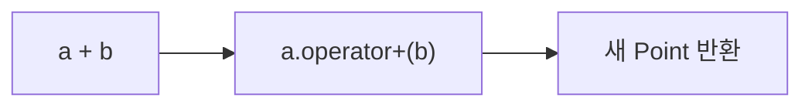
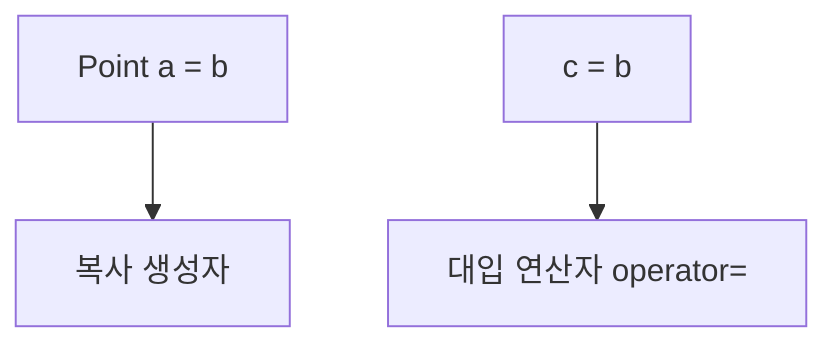

# Podcast 03 — 연산자 오버로딩
- [팟캐스트 링크](https://notebook.google.com/notebook/7c192b19-7039-4a6f-91df-d5fca478ffb0/artifact/00a12f43-d205-4385-9be8-002307002cfa?utm_source=nlm_web_share&utm_medium=google_oo&utm_campaign=art_share_1&utm_content=&utm_smc=nlm_web_share_google_oo_art_share_1_)


## 학습 자료

- [연산자 오버로딩](https://modoocode.com/202)

## 이번 회차의 목표

이번 회차의 목표는 연산자 오버로딩 문법을 전부 암기하는 것이 아니다. 다음 한 가지를 이해하면 충분하다.

> **연산자도 함수이며, 사용자 정의 타입에 맞게 그 함수의 동작을 정의할 수 있다.**

`int`는 원래 `+`, `-`, `==`를 사용할 수 있다. 하지만 우리가 만든 `Point`, `Money`, `MyString` 같은 클래스에 대해서는 컴파일러가 무엇을 더하고, 무엇을 비교해야 하는지 알 수 없다. 이때 `operator+`, `operator==` 같은 함수를 작성하여 연산의 의미를 알려준다.

## 1. 왜 연산자 오버로딩이 필요한가?

2차원 좌표를 표현하는 `Point` 클래스가 있다고 생각해 보자.

```cpp
class Point {
 private:
  int x_;
  int y_;

 public:
  Point(int x, int y) : x_(x), y_(y) {}
};
```

두 좌표를 더하고 싶어도 현재 상태에서는 다음 코드가 컴파일되지 않는다.

```cpp
Point a{1, 2};
Point b{3, 4};

// Point c = a + b;  // ❌ Point의 +가 무엇인지 정의되지 않음
```

일반 멤버 함수로 덧셈을 표현할 수도 있다.

```cpp
Point c = a.Add(b);
```

하지만 좌표의 덧셈이라는 의미에는 아래 표현이 더 자연스럽다.

```cpp
Point c = a + b;
```

연산자 오버로딩은 새로운 기능을 마법처럼 만드는 문법이 아니다. 이미 함수로 구현할 수 있는 동작을 해당 타입에 어울리는 연산자 문법으로 표현하는 방법이다.

## 2. 연산자는 함수다

멤버 함수로 `+`를 오버로딩하는 기본 형태는 다음과 같다.

```cpp
반환형 operator연산자(매개변수);
```

예를 들어 `Point`의 `+`는 다음처럼 정의할 수 있다.

```cpp
Point operator+(const Point& other) const;
```

사용자가 작성한 표현과 대응되는 함수 호출을 비교해 보자.

| 작성한 표현 | 함수 호출로 생각하기 |
| --- | --- |
| `a + b` | `a.operator+(b)` |
| `a - b` | `a.operator-(b)` |
| `a == b` | `a.operator==(b)` |
| `a += b` | `a.operator+=(b)` |



컴파일러가 반드시 소스 코드를 저 문자열 그대로 바꾼다는 뜻은 아니다. 처음 배울 때는 **연산자 표현이 연산자 함수 호출과 같은 의미로 해석된다**고 이해하면 된다.

## 3. `Point`에 `+`, `-`, `==` 정의하기

다음은 바로 컴파일해서 실행할 수 있는 최소 예제다.

```cpp
#include <iostream>

class Point {
 private:
  int x_;
  int y_;

 public:
  Point(int x, int y) : x_(x), y_(y) {}

  Point operator+(const Point& other) const {
    return Point{x_ + other.x_, y_ + other.y_};
  }

  Point operator-(const Point& other) const {
    return Point{x_ - other.x_, y_ - other.y_};
  }

  bool operator==(const Point& other) const {
    return x_ == other.x_ && y_ == other.y_;
  }

  void Print() const {
    std::cout << '(' << x_ << ", " << y_ << ")\n";
  }
};

int main() {
  Point a{1, 2};
  Point b{3, 4};

  Point sum = a + b;
  Point difference = b - a;

  sum.Print();         // (4, 6)
  difference.Print();  // (2, 2)

  std::cout << std::boolalpha;
  std::cout << (a == b) << '\n';          // false
  std::cout << (sum == Point{4, 6}) << '\n';  // true
}
```

### 코드를 읽는 방법

```cpp
Point sum = a + b;
```

위 코드는 다음과 같은 의미다.

```cpp
Point sum = a.operator+(b);
```

여기서 각 객체의 역할은 다음과 같다.

- `a`: 연산자 함수를 호출하는 왼쪽 피연산자, 즉 `*this`
- `b`: 함수 인자로 전달되는 오른쪽 피연산자, 즉 `other`
- 반환값: 두 객체를 이용해 만든 새로운 `Point`

## 4. 일반 함수와 연산자 함수의 관계

일반 함수와 연산자 함수는 이름과 호출 문법이 다를 뿐, 입력을 받고 결과를 반환한다는 기본 원리는 같다.

```cpp
Point Add(const Point& other) const;
Point operator+(const Point& other) const;
```

| 구분 | 일반 멤버 함수 | 연산자 오버로딩 |
| --- | --- | --- |
| 정의 | `Point Add(const Point&) const` | `Point operator+(const Point&) const` |
| 호출 | `a.Add(b)` | `a + b` |
| 내부 구현 | 직접 작성 | 직접 작성 |
| 장점 | 동작 이름이 구체적임 | 수학적·관용적 표현이 자연스러움 |

둘 중 무엇이 항상 더 좋은 것은 아니다. 연산자의 의미가 직관적일 때만 오버로딩하는 것이 좋다.

```cpp
Point c = a + b;       // ✅ 두 좌표 성분을 더한다는 의미가 자연스러움
// Point c = a * b;    // ⚠️ 곱셈의 의미가 불분명하면 일반 함수를 쓰는 편이 나음
```

연산자 오버로딩은 코드를 짧게 만드는 기술보다, 클래스의 사용 방법을 자연스럽게 설계하는 인터페이스 기술에 가깝다.

## 5. 왜 매개변수에 `const Point&`를 쓰는가?

```cpp
Point operator+(const Point& other) const;
```

이 한 줄에는 서로 다른 두 가지 `const`가 있다.

| 위치 | 의미 |
| --- | --- |
| `const Point& other` | 오른쪽 객체 `other`를 함수 안에서 변경하지 않음 |
| 함수 뒤의 `const` | 왼쪽 객체인 `*this`를 변경하지 않음 |

`a + b`를 계산한다고 해서 일반적으로 `a`나 `b`가 바뀌지는 않는다. 그러므로 두 객체를 모두 읽기 전용으로 다루고 새로운 결과 객체를 반환한다.

```cpp
Point c = a + b;

// a와 b는 그대로 유지되고 c가 새로 만들어진다.
```

## 6. `+`와 `+=`는 역할이 다르다

`+`는 새로운 결과를 만들지만, `+=`는 왼쪽 객체 자체를 변경한다.

```cpp
Point operator+(const Point& other) const;
Point& operator+=(const Point& other);
```

```cpp
Point& operator+=(const Point& other) {
  x_ += other.x_;
  y_ += other.y_;
  return *this;
}
```

| 표현 | 왼쪽 객체 변경 | 일반적인 반환형 |
| --- | --- | --- |
| `a + b` | 변경하지 않음 | 새 객체를 값으로 반환 |
| `a += b` | 변경함 | 변경된 자기 자신을 참조로 반환 |

`operator+=`가 `Point&`를 반환하면 다음처럼 연속된 표현도 가능하다.

```cpp
a += b += c;
```

다만 지금 단계에서는 **`+`는 새 값, `+=`는 자기 자신 변경** 정도만 기억하면 충분하다.

## 7. 복사 생성자와 대입 연산자는 다르다

겉모습이 비슷해도 다음 두 코드는 서로 다른 함수를 사용한다.

```cpp
Point a = b;  // 새로운 a 생성: 복사 생성자

Point c{0, 0};
c = b;        // 이미 존재하는 c에 대입: operator=
```



멤버가 단순한 `int`뿐이라면 컴파일러가 제공하는 기본 대입 연산자로도 충분하다. 하지만 `char*`처럼 동적 메모리를 직접 소유한다면 기본 대입은 주소만 복사하는 얕은 복사 문제가 생길 수 있으므로 `operator=`도 직접 검토해야 한다.

## 8. 연산자 오버로딩에서 기억할 원칙

1. 연산자의 원래 의미와 크게 어긋나지 않게 만든다.
2. `+`처럼 새 결과를 만드는 연산은 원본 객체를 변경하지 않는다.
3. 읽기만 하는 매개변수는 `const T&`로 받는 것을 우선 검토한다.
4. 객체를 변경하지 않는 연산자 함수에는 함수 뒤에 `const`를 붙인다.
5. 연산자만 보고 동작을 예상하기 어렵다면 이름 있는 일반 함수를 사용한다.

연산자의 우선순위와 피연산자 개수는 새로 바꿀 수 없다. 예를 들어 `+`를 오버로딩해도 기존 `+`의 우선순위와 두 피연산자를 사용한다는 성질은 그대로다.

## 복습 문제 — 직접 구현하기

### 문제 1. `Point`의 `!=` 구현

앞의 `Point` 클래스에 `operator!=`를 구현하라.

조건:

- 두 좌표 중 하나라도 다르면 `true`를 반환한다.
- 이미 작성한 `operator==`를 재사용한다.

```cpp
Point a{1, 2};
Point b{1, 3};

std::cout << (a != b) << '\n';  // true
```

### 문제 2. `Counter`의 `+`와 `+=` 구현

정수 값을 보관하는 `Counter` 클래스를 작성하고 다음 연산을 지원하라.

- `a + b`: 두 값을 더한 새로운 `Counter` 반환
- `a += b`: `a` 자체의 값을 변경하고 `Counter&` 반환
- `value() const`: 현재 값 조회

아래 코드가 실행된 뒤 `a`, `b`, `c`의 값을 직접 예상해 보자.

```cpp
Counter a{10};
Counter b{5};
Counter c = a + b;
a += b;
```

### 문제 3. 코드의 문제점 찾기

다음 `operator+`에는 어떤 문제가 있는가?

```cpp
Point& operator+(const Point& other) {
  x_ += other.x_;
  y_ += other.y_;
  return *this;
}
```

다음 관점에서 설명해 보자.

- `a + b`를 실행했을 때 `a`가 어떻게 되는가?
- 일반적인 `+`의 의미와 일치하는가?
- 어떤 반환형과 구현이 더 적절한가?

### 문제 4. Product 가격 비교

상품명과 가격을 저장하는 `Product` 클래스에 `operator==`를 구현하라.

이번 문제에서는 **상품명과 가격이 모두 같을 때** 같은 상품으로 판단한다.

```cpp
Product first{"Keyboard", 50000};
Product second{"Keyboard", 50000};
Product third{"Mouse", 30000};

std::cout << (first == second) << '\n';  // true
std::cout << (first == third) << '\n';   // false
```

구현 후에는 “같은 상품”의 기준을 상품명만으로 볼지, 가격까지 포함할지에 따라 `operator==`의 의미가 어떻게 달라지는지도 생각해 보자.

## 한 줄 요약

> **연산자 오버로딩은 `+`, `-`, `==` 같은 연산자를 함수로 정의하여, 사용자 정의 타입도 그 의미에 맞는 자연스러운 문법으로 사용할 수 있게 하는 기능이다.**
