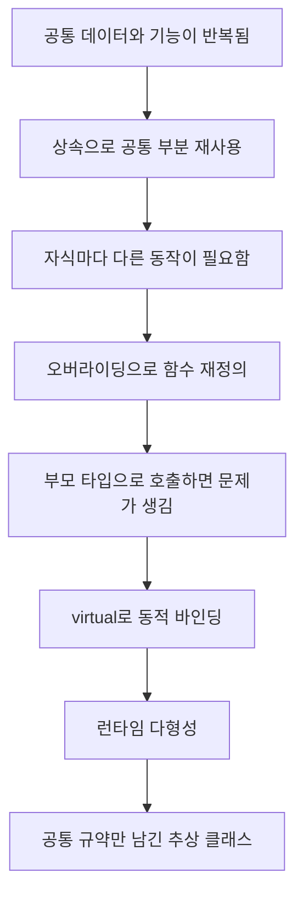
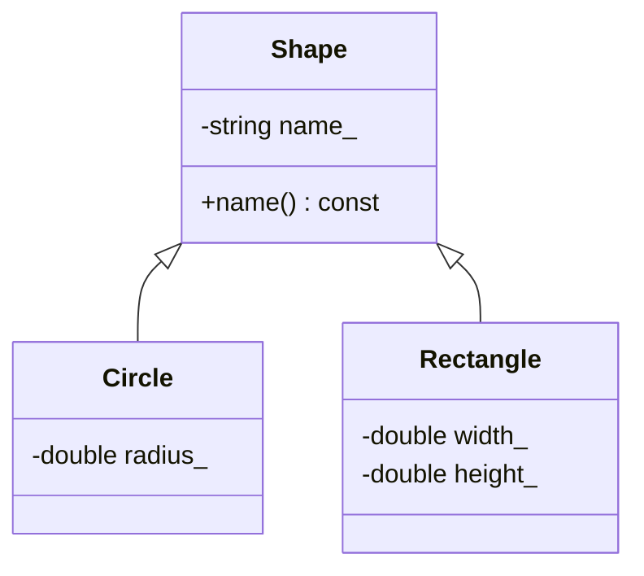
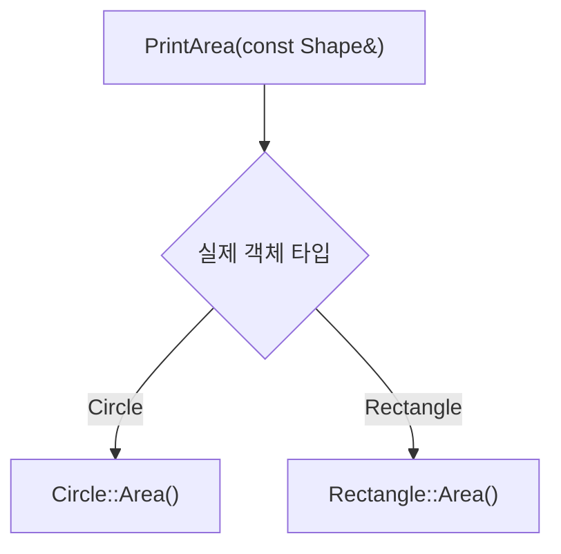

# Podcast 04 — 상속과 다형성

- [팟캐스트 링크](https://notebook.google.com/notebook/7c192b19-7039-4a6f-91df-d5fca478ffb0/artifact/2163d6f4-1700-4d96-a088-2af2798c576d?utm_source=nlm_web_share&utm_medium=google_oo&utm_campaign=art_share_1&utm_content=&utm_smc=nlm_web_share_google_oo_art_share_1_)

## 학습 자료

- [C++ 표준 문자열과 상속](https://modoocode.com/209)
- [가상 함수와 다형성](https://modoocode.com/210)
- [가상 함수와 상속에 관련된 내용](https://modoocode.com/211)

## 이번 노트의 목표

이번 장에서 외워야 할 키워드는 많지 않다. 다음 질문에 답할 수 있으면 된다.

> **부모 타입 하나로 여러 자식 객체를 다루면서, 각 객체에 맞는 함수를 실행하려면 어떻게 해야 할까?**

이 질문을 해결하는 과정에서 다음 개념이 순서대로 등장한다.



# 1. 상속은 왜 필요한가?

원의 넓이를 구하는 `Circle`과 사각형의 넓이를 구하는 `Rectangle`을 만든다고 해보자. 두 클래스 모두 이름을 저장하고 출력하는 기능이 필요하다.

상속을 사용하지 않으면 `name_`, `name()`, 생성자처럼 공통된 코드가 각 클래스에 반복된다. 클래스가 늘어날수록 같은 코드를 여러 곳에서 수정해야 한다.

상속은 이 공통 부분을 부모 클래스에 모으고, 자식 클래스가 물려받게 하는 기능이다.

```cpp
class Shape {
private:
    std::string name_;

public:
    explicit Shape(const std::string& name) : name_(name) {}

    const std::string& name() const {
        return name_;
    }
};

class Circle : public Shape {
private:
    double radius_;

public:
    Circle(const std::string& name, double radius)
        : Shape(name), radius_(radius) {}
};
```

`Circle : public Shape`는 다음 관계를 뜻한다.

- `Shape`: 기반 클래스(Base Class), 부모 클래스
- `Circle`: 파생 클래스(Derived Class), 자식 클래스
- `Circle`은 `Shape`의 공개 인터페이스를 물려받는다.
- `Circle` 객체 안에는 `Shape` 부분과 `Circle` 고유 부분이 함께 존재한다.



## 1.1 `is-a` 관계

상속은 단순히 코드를 복사하는 기능이 아니다. 자식이 부모의 한 종류라고 말할 수 있을 때 자연스럽다.

- `Circle`은 하나의 `Shape`이다. → `is-a` 관계이므로 상속이 자연스럽다.
- `Car`는 하나의 `Engine`이다. → 틀린 관계다. 자동차는 엔진을 **가지고 있다**.

두 번째처럼 `has-a` 관계라면 상속보다 멤버 변수로 포함하는 합성(composition)이 적합하다.

## 1.2 부모 생성자는 먼저 실행된다

자식 객체를 만들려면 그 안의 부모 부분부터 완성해야 한다. 따라서 생성 순서는 부모 → 자식이고, 소멸 순서는 그 반대인 자식 → 부모다.

```cpp
Circle(const std::string& name, double radius)
    : Shape(name), radius_(radius) {}
```

여기서 `Shape(name)`은 `Circle` 안에 들어 있는 `Shape` 부분을 초기화한다.

## 1.3 `private`와 `protected`

부모의 `private` 멤버는 자식에서도 직접 접근할 수 없다. 자식도 부모 클래스의 외부 사용자처럼 공개 또는 보호된 인터페이스를 통해 접근해야 한다.

| 접근 지정자 | 부모 클래스 내부 | 자식 클래스 내부 | 클래스 외부 |
|---|---:|---:|---:|
| `public` | 가능 | 가능 | 가능 |
| `protected` | 가능 | 가능 | 불가능 |
| `private` | 가능 | 불가능 | 불가능 |

`protected`를 쓰면 자식이 직접 접근할 수 있지만, 데이터의 변경 규칙이 여러 자식 클래스에 퍼질 수 있다. 멤버 변수는 우선 `private`로 두고 필요한 함수를 제공하는 편이 캡슐화를 유지하기 쉽다.

# 2. 오버라이딩 — 물려받은 동작을 자식에 맞게 바꾸기

모든 도형은 넓이를 구할 수 있지만 계산 방법은 서로 다르다.

```cpp
class Shape {
public:
    double Area() const {
        return 0.0;
    }
};

class Circle : public Shape {
public:
    double Area() const {
        return 3.141592 * radius_ * radius_;
    }
};
```

자식 클래스가 부모와 같은 형태의 함수를 다시 정의하는 것을 오버라이딩(overriding)이라고 한다.

오버로딩과 이름이 비슷하지만 목적은 다르다.

| 구분 | 오버로딩(Overloading) | 오버라이딩(Overriding) |
|---|---|---|
| 관계 | 같은 범위의 함수들 | 부모와 자식의 함수 |
| 함수 이름 | 같음 | 같음 |
| 매개변수 | 서로 달라야 함 | 부모 함수와 일치해야 함 |
| 목적 | 입력에 따른 여러 사용법 제공 | 자식에 맞는 동작으로 재정의 |

하지만 아직 문제가 하나 남아 있다.

# 3. 실제 문제 — 부모 타입으로 호출하면 어떤 함수가 실행될까?

상속의 장점은 `Circle`과 `Rectangle`을 모두 `Shape`로 다룰 수 있다는 것이다.

```cpp
void PrintArea(const Shape& shape) {
    std::cout << shape.Area() << '\n';
}

Circle circle("원", 2.0);
PrintArea(circle);
```

`PrintArea()`의 매개변수 타입은 `const Shape&`다. 이 함수는 `Circle`을 전달받을 수 있지만, `Area()`가 가상 함수가 아니라면 컴파일러는 참조의 타입만 보고 `Shape::Area()` 호출을 결정한다.

```text
실제 객체: Circle
참조 타입: const Shape&
호출 결과: Shape::Area()  ← 원의 넓이가 나오지 않는다!
```

오버라이딩만 했다고 해서 부모 포인터나 부모 참조를 통한 호출이 자동으로 자식 함수에 연결되는 것은 아니다.

# 4. `virtual` — 실제 객체를 보고 함수를 선택하라

부모 함수에 `virtual`을 붙이면 호출할 함수를 컴파일 시점에 고정하지 않고, 실행 중 실제 객체의 타입을 보고 선택한다.

```cpp
class Shape {
public:
    virtual double Area() const {
        return 0.0;
    }
};

class Circle : public Shape {
public:
    double Area() const override {
        return 3.141592 * radius_ * radius_;
    }
};
```

이제 같은 코드의 의미가 달라진다.

```cpp
const Shape& shape = circle;
std::cout << shape.Area() << '\n';
```

1. 변수의 정적 타입은 `const Shape&`다.
2. `Area()`가 가상 함수인지 확인한다.
3. 실행 중 `shape`가 실제로 참조하는 객체를 확인한다.
4. 실제 객체가 `Circle`이므로 `Circle::Area()`를 호출한다.

이처럼 실행 중 호출 대상을 정하는 것을 동적 바인딩(dynamic binding)이라고 한다. 반대로 컴파일할 때 호출 함수가 결정되는 것은 정적 바인딩(static binding)이다.

| 함수 | 호출 기준 | 결정 시점 |
|---|---|---|
| 일반 멤버 함수 | 포인터·참조의 정적 타입 | 컴파일 시간 |
| 가상 함수 | 실제 객체의 동적 타입 | 실행 시간 |

## 4.1 `virtual`은 런타임 다형성을 가능하게 한다

다형성(polymorphism)은 같은 인터페이스를 호출해도 실제 객체에 따라 서로 다른 동작이 실행되는 성질이다.

```cpp
void PrintArea(const Shape& shape) {
    std::cout << shape.name() << ": " << shape.Area() << '\n';
}

PrintArea(circle);     // Circle::Area()
PrintArea(rectangle);  // Rectangle::Area()
```

`PrintArea()`는 `Circle`이나 `Rectangle`을 구분하는 `if`문을 갖지 않는다. 그저 `Shape`의 공통 인터페이스를 호출한다. 어떤 계산을 수행할지는 각 객체가 책임진다.



이 구조에서는 새로운 `Triangle`을 추가해도 `PrintArea()`를 고칠 필요가 없다. 부모의 인터페이스를 지키는 새 자식 클래스를 추가하면 된다.

## 4.2 가상 함수 테이블은 어떻게 연결하는가?

대표적인 C++ 구현에서는 가상 함수가 있는 객체가 가상 함수 테이블(vtable)을 가리키는 숨은 포인터를 가진다. 테이블에는 실제 타입에 맞는 가상 함수 주소가 들어 있다.

가상 함수를 호출할 때 프로그램은 개념적으로 다음 과정을 거친다.

```text
객체 → 가상 함수 테이블 → 실제 타입의 Area() 주소 → 함수 실행
```

이것이 `virtual`이 단순한 표시가 아니라 런타임에 실제 함수를 선택할 수 있게 하는 원리다. 다만 vtable의 구체적인 구조는 C++ 표준이 강제하는 문법 규칙이 아니라 컴파일러가 흔히 사용하는 구현 방식이다.

# 5. `override` — 오버라이딩 실수를 컴파일러가 찾게 하기

자식 함수 뒤에는 `override`를 붙이는 습관을 들이는 것이 좋다.

```cpp
double Area() const override;
```

`override`는 이 함수가 부모의 가상 함수를 실제로 재정의하는지 컴파일러가 검사하게 한다.

```cpp
class Shape {
public:
    virtual double Area() const;
};

class Circle : public Shape {
public:
    double Area() override;  // ❌ const가 빠져 컴파일 오류
};
```

`override`가 없다면 위 함수는 부모 함수와 별개의 함수가 되어 버릴 수 있다. `override`를 붙이면 이런 실수를 즉시 발견할 수 있다.

# 6. 순수 가상 함수와 추상 클래스

`Shape::Area()`가 항상 `0.0`을 반환하도록 만드는 것은 이상하다. '일반 도형'의 넓이 계산법은 존재하지 않으며, 원이나 사각형처럼 구체적인 도형만 계산법을 갖는다.

이럴 때 부모는 구현을 억지로 제공하지 않고, 자식이 반드시 구현해야 할 규약만 선언할 수 있다.

```cpp
class Shape {
public:
    virtual double Area() const = 0;
};
```

`= 0`이 붙은 가상 함수를 순수 가상 함수(pure virtual function)라고 한다. 순수 가상 함수를 하나 이상 가진 클래스를 추상 클래스(abstract class)라고 한다.

- 추상 클래스의 객체는 직접 생성할 수 없다.
- 추상 클래스의 포인터와 참조는 사용할 수 있다.
- 자식 클래스는 모든 순수 가상 함수를 구현해야 구체 객체를 만들 수 있다.
- 추상 클래스는 자식들이 지켜야 할 공통 인터페이스 또는 설계도 역할을 한다.

```cpp
Shape shape;              // ❌ 추상 클래스 객체는 생성 불가
Circle circle("원", 2);  // ✅ Area()를 구현한 구체 클래스
Shape& ref = circle;      // ✅ 추상 클래스의 참조는 가능
```

# 7. 다형적 기반 클래스에는 가상 소멸자가 필요하다

부모 포인터로 자식 객체를 삭제할 가능성이 있다면 부모 소멸자는 반드시 `virtual`이어야 한다.

```cpp
class Shape {
public:
    virtual ~Shape() = default;
    virtual double Area() const = 0;
};

Shape* shape = new Circle("원", 2.0);
delete shape;
```

가상 소멸자가 있으면 `Circle` 소멸자 → `Shape` 소멸자 순서로 올바르게 호출된다. 가상 소멸자가 없는데 부모 포인터로 자식 객체를 삭제하면 동작이 정의되지 않는다.

동적 할당을 직접 관리할 때는 이 규칙이 특히 중요하다. 이후에는 `std::unique_ptr<Shape>` 같은 스마트 포인터를 사용해 소유권을 더 안전하게 관리하게 된다.

# 8. 전체 예제

다음 코드는 상속, 오버라이딩, 가상 함수, 런타임 다형성, 추상 클래스를 하나로 연결한 실행 가능한 예제다.

```cpp
#include <iostream>
#include <string>

class Shape {
private:
    std::string name_;

public:
    explicit Shape(const std::string& name) : name_(name) {}
    virtual ~Shape() = default;

    const std::string& name() const {
        return name_;
    }

    virtual double Area() const = 0;
};

class Circle : public Shape {
private:
    double radius_;

public:
    Circle(const std::string& name, double radius)
        : Shape(name), radius_(radius) {}

    double Area() const override {
        constexpr double pi = 3.141592;
        return pi * radius_ * radius_;
    }
};

class Rectangle : public Shape {
private:
    double width_;
    double height_;

public:
    Rectangle(const std::string& name, double width, double height)
        : Shape(name), width_(width), height_(height) {}

    double Area() const override {
        return width_ * height_;
    }
};

void PrintArea(const Shape& shape) {
    std::cout << shape.name() << ": " << shape.Area() << '\n';
}

int main() {
    Circle circle("Circle", 2.0);
    Rectangle rectangle("Rectangle", 3.0, 4.0);

    PrintArea(circle);
    PrintArea(rectangle);
}
```

실행 결과:

```text
Circle: 12.5664
Rectangle: 12
```

# 9. 자주 하는 실수

## 9.1 값으로 받으면 객체 슬라이싱이 일어난다

```cpp
void PrintArea(Shape shape);        // ❌ 자식 고유 부분이 잘릴 수 있음
void PrintArea(const Shape& shape); // ✅ 참조로 받아 다형성 유지
```

자식 객체를 부모 타입의 값으로 복사하면 부모 부분만 남는 객체 슬라이싱(object slicing)이 발생한다. 추상 클래스는 애초에 값 객체를 만들 수 없지만, 일반 기반 클래스에서도 다형성을 사용할 때는 포인터나 참조를 사용해야 한다.

## 9.2 상속만으로 다형성이 생기는 것은 아니다

다음 세 조건이 함께 필요하다.

1. 부모와 자식의 상속 관계
2. 부모에 선언된 가상 함수와 자식의 오버라이딩
3. 부모 타입의 포인터 또는 참조를 통한 호출

## 9.3 모든 함수를 무조건 `virtual`로 만들 필요는 없다

자식에 따라 동작이 달라져야 하고, 부모 인터페이스를 통해 호출할 함수에 `virtual`을 사용한다. 항상 동일해야 하는 함수까지 무조건 가상 함수로 만들 필요는 없다.

# 10. 개념 연결 정리

| 단계 | 생긴 문제 | C++의 해결책 |
|---|---|---|
| 상속 | 여러 클래스에 공통 코드가 반복됨 | 공통 데이터와 기능을 기반 클래스에 모음 |
| 오버라이딩 | 자식마다 같은 기능의 동작이 다름 | 자식이 부모 함수를 재정의함 |
| `virtual` | 부모 타입으로 호출하면 부모 함수가 선택됨 | 실제 객체의 타입을 런타임에 확인함 |
| 다형성 | 여러 자식 타입을 각각 분기해 처리해야 함 | 부모 인터페이스 하나로 각자의 동작을 실행함 |
| 추상 클래스 | 부모가 제공할 수 없는 가짜 기본 구현이 생김 | 순수 가상 함수로 구현 의무만 선언함 |

결국 이 개념들은 따로 떨어진 문법이 아니다.

> **상속으로 공통 관계를 만들고, 오버라이딩으로 차이를 표현하며, `virtual`로 그 차이를 런타임에 선택하면 다형성이 된다. 부모가 공통 규약만 정의하도록 만들면 추상 클래스가 된다.**

# 복습 문제

## 문제 1 — 출력 결과 예측

다음 코드에서 `virtual`이 없을 때와 있을 때 각각 무엇이 출력되는지 예측해 보자.

```cpp
class Player {
public:
    void Play() const { std::cout << "Player\n"; }
};

class AudioPlayer : public Player {
public:
    void Play() const { std::cout << "Audio\n"; }
};

void Start(const Player& player) {
    player.Play();
}
```

## 문제 2 — 오버라이딩 버그 찾기

다음 함수가 오버라이딩되지 않는 이유를 찾고 수정해 보자. 수정할 때 `override`를 사용하자.

```cpp
class Formatter {
public:
    virtual std::string Format() const;
};

class JsonFormatter : public Formatter {
public:
    std::string Format();
};
```

## 문제 3 — 직접 구현: 알림 시스템

다음 요구사항에 맞춰 코드를 작성해 보자.

- 추상 클래스 `Notifier`를 만든다.
- `Notifier`에 순수 가상 함수 `Send(const std::string& message) const`를 선언한다.
- 가상 소멸자를 선언한다.
- `EmailNotifier`와 `ConsoleNotifier`가 `Notifier`를 상속한다.
- 각 자식 클래스에서 `Send()`를 서로 다르게 오버라이딩한다.
- `void Notify(const Notifier& notifier, const std::string& message)` 함수 하나로 두 객체를 모두 처리한다.

## 문제 4 — 설계 판단

다음 관계에서 상속과 합성 중 더 자연스러운 방식을 고르고 이유를 설명해 보자.

1. `Dog`와 `Animal`
2. `Car`와 `Engine`
3. `PdfExporter`와 `Exporter`
4. `User`와 `Address`

## 한 줄 요약

> **부모 타입 하나로 여러 자식 객체를 다루되 실제 객체에 맞는 오버라이딩 함수가 실행되게 하는 것이 `virtual` 기반 런타임 다형성이다.**
