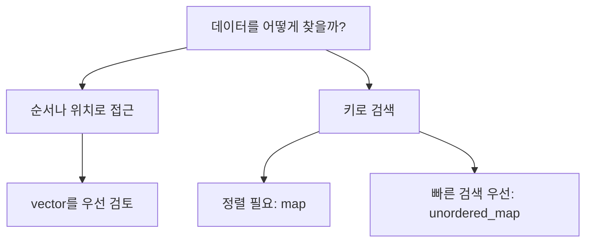

# Podcast 06 — STL: 실무 C++ 자료구조와 알고리즘

- [팟캐스트 링크](https://notebook.google.com/notebook/7c192b19-7039-4a6f-91df-d5fca478ffb0/artifact/ca92039f-455f-4b58-b743-404a27fdc8f9?utm_source=nlm_web_share&utm_medium=google_oo&utm_campaign=art_share_1&utm_content=&utm_smc=nlm_web_share_google_oo_art_share_1_)

## 학습 자료

- [vector, list, deque](https://modoocode.com/223)
- [set, map, unordered_set, unordered_map](https://modoocode.com/224)
- [STL algorithm](https://modoocode.com/225)
- [string과 string_view](https://modoocode.com/292)

## 이번 노트의 목표

STL 컨테이너의 모든 API를 암기하는 것이 목표가 아니다. **내 데이터에 어떤 작업을 자주 수행하는지 보고 알맞은 컨테이너를 고르는 것**이 목표다.



# 1. STL의 세 구성요소

STL은 세 역할을 분리한다.

| 구성요소 | 역할 | 예시 |
|---|---|---|
| Container | 데이터를 보관 | `vector`, `map` |
| Iterator | 컨테이너의 원소 위치를 표현 | `begin()`, `end()` |
| Algorithm | 반복자 범위에 작업 수행 | `sort`, `find` |

컨테이너가 데이터를 담고, 반복자가 범위를 가리키며, 알고리즘이 그 범위를 처리한다.

# 2. 시퀀스 컨테이너

## 2.1 `vector` — 실무의 기본 선택

`vector`는 크기가 변할 수 있는 연속 배열이다. 원소가 메모리에 연속해서 저장되므로 인덱스 접근이 빠르고 캐시 효율도 좋다.

```cpp
std::vector<int> scores{80, 90};
scores.push_back(95);
std::cout << scores[1];
```

| 작업 | 복잡도 |
|---|---:|
| 인덱스 접근 | `O(1)` |
| 뒤에 추가 | 평균 `O(1)` |
| 중간 삽입·삭제 | `O(n)` |
| 값 검색 | `O(n)` |

언제 쓰는가?

- 원소를 순서대로 저장한다.
- 인덱스로 자주 접근한다.
- 주로 뒤에 추가한다.
- 특별한 이유가 없다면 우선 `vector`를 검토한다.

용량이 부족하면 더 큰 메모리를 할당하고 기존 원소를 이동한다. 이 재할당으로 기존 포인터·참조·반복자가 무효화될 수 있다. 크기를 예상할 수 있으면 `reserve()`로 용량을 미리 확보할 수 있다.

## 2.2 `list` — 노드 연결 구조

`list`는 각 원소가 다음·이전 노드를 가리키는 이중 연결 리스트다.

- 알고 있는 위치에서 삽입·삭제: `O(1)`
- 임의 위치 접근: `O(n)`
- `list[5]` 같은 인덱스 접근 불가
- 노드마다 포인터가 필요하고 메모리가 흩어져 캐시 효율이 낮다.

중간 삽입·삭제가 많다는 이유만으로 곧바로 `list`를 선택하면 안 된다. 삽입 위치까지 찾아가는 비용과 낮은 캐시 효율 때문에 실제로는 `vector`가 더 빠른 경우도 많다.

## 2.3 `deque` — 앞뒤 삽입이 모두 필요한 큐

`deque`는 양쪽 끝에서 빠르게 원소를 넣고 뺄 수 있다.

```cpp
std::deque<int> jobs;
jobs.push_back(20);
jobs.push_front(10);
jobs.pop_front();
```

- 앞·뒤 삽입과 삭제: `O(1)`
- 인덱스 접근: `O(1)`
- 메모리가 하나의 완전한 연속 구간이라는 보장은 없음

양쪽 끝을 모두 사용하는 대기열이나 작업 큐에 적합하다.

# 3. 연관 컨테이너

## 3.1 `set` — 중복 없는 정렬 집합

`set<T>`는 값을 중복 없이 저장하며 자동으로 정렬한다.

```cpp
std::set<int> ids{30, 10, 20, 10};
// 저장 결과: 10, 20, 30
```

삽입·검색·삭제는 일반적으로 `O(log n)`이다. 중복 제거와 정렬된 순회가 동시에 필요할 때 사용한다.

## 3.2 `map` — 정렬된 키와 값

`map<Key, Value>`는 키마다 값을 연결하며 키를 정렬된 상태로 유지한다.

```cpp
std::map<std::string, int> scores;
scores["Alice"] = 90;
scores["Bob"] = 80;
```

- 키 중복 불가
- 키 순서대로 순회 가능
- 삽입·검색·삭제: `O(log n)`
- 범위 검색에 유리

설정값, 이름별 객체, ID별 레코드처럼 키로 값을 찾을 때 사용한다. 결과가 항상 정렬되어야 하거나 특정 키 범위를 순회해야 한다면 `map`이 적합하다.

주의: `scores["Charlie"]`는 키가 없으면 기본값을 가진 항목을 새로 만든다. 조회만 하려면 `find()`, `contains()`(C++20), `at()` 등을 의도에 맞게 사용한다.

## 3.3 `unordered_set`, `unordered_map` — 해시 기반 검색

`unordered_map<Key, Value>`는 키의 해시값을 이용해 저장 위치를 찾는다.

```cpp
std::unordered_map<std::string, int> scores;
scores["Alice"] = 90;
```

- 평균 삽입·검색·삭제: `O(1)`
- 최악의 경우: `O(n)`
- 순회 순서가 정렬되거나 고정된다는 보장 없음
- 키 타입에 해시와 동등 비교가 필요

정렬이 필요 없고 키 조회 성능이 중요한 사전·캐시·색인에 자주 사용한다. `unordered_set`은 값만 저장하는 해시 집합이다.

## 3.4 `map`과 `unordered_map` 선택

| 기준 | `map` | `unordered_map` |
|---|---|---|
| 내부 개념 | 균형 트리 | 해시 테이블 |
| 평균 검색 | `O(log n)` | `O(1)` |
| 순서 | 키 정렬 | 보장 없음 |
| 범위 검색 | 적합 | 부적합 |
| 사용자 정의 키 | 비교 연산 필요 | 해시와 동등 비교 필요 |

실무 판단:

- 키 순서·범위 검색·결정적인 순회가 필요하다 → `map`
- 순서가 필요 없고 단건 검색이 핵심이다 → `unordered_map`
- 데이터가 작다면 복잡도보다 코드 명확성과 측정 결과를 우선한다.

# 4. 컨테이너 선택표

| 필요 | 우선 검토 |
|---|---|
| 일반적인 순차 저장 | `vector` |
| 앞뒤에서 빈번하게 삽입·삭제 | `deque` |
| 안정적인 노드 위치와 알려진 위치의 삽입·삭제 | `list` |
| 정렬된 중복 없는 값 | `set` |
| 정렬된 키-값 | `map` |
| 빠른 평균 조회의 중복 없는 값 | `unordered_set` |
| 빠른 평균 조회의 키-값 | `unordered_map` |

# 5. Iterator — 컨테이너용 포인터

C 포인터가 배열의 위치를 가리키듯 반복자는 컨테이너의 원소 위치를 표현한다.

```cpp
int array[3]{10, 20, 30};
int* pointer = array;
std::cout << *pointer;

std::vector<int> values{10, 20, 30};
auto iterator = values.begin();
std::cout << *iterator;
```

| 포인터 동작 | 반복자 동작 |
|---|---|
| `*p` | `*it`: 현재 원소 접근 |
| `++p` | `++it`: 다음 원소로 이동 |
| 배열 시작 주소 | `container.begin()` |
| 마지막 뒤 주소 | `container.end()` |

`end()`는 마지막 원소가 아니라 마지막 원소의 다음 위치다. `[begin, end)` 범위를 사용하면 빈 범위도 `begin == end`로 자연스럽게 표현할 수 있다.

모든 반복자가 포인터와 똑같은 연산을 지원하지는 않는다. `vector` 반복자는 `it + 3`이 가능하지만 `list` 반복자는 한 칸씩 이동해야 한다.

# 6. Algorithm — 컨테이너와 동작을 분리하기

STL 알고리즘은 특정 컨테이너가 아니라 반복자 범위를 받는다.

```cpp
#include <algorithm>
#include <vector>

std::vector<int> numbers{4, 1, 3, 2};

std::sort(numbers.begin(), numbers.end());
auto found = std::find(numbers.begin(), numbers.end(), 3);
```

`sort`는 임의 위치로 빠르게 이동할 수 있는 반복자가 필요하므로 `vector`에는 사용할 수 있지만 `list`에는 직접 사용할 수 없다. `list`는 자체 `sort()`를 제공한다.

자주 만나는 알고리즘의 목적만 기억하자.

| 알고리즘 | 목적 |
|---|---|
| `sort` | 정렬 |
| `find` | 값 검색 |
| `count` | 값 개수 계산 |
| `transform` | 각 원소를 변환 |
| `remove_if` | 조건에 맞는 원소를 뒤로 이동 |

컨테이너에서 조건에 맞는 원소를 실제 삭제할 때는 C++20의 `std::erase_if`가 편리하다. 이전 표준에서는 erase-remove 관용구를 사용한다.

```cpp
numbers.erase(
    std::remove_if(numbers.begin(), numbers.end(),
                   [](int value) { return value < 0; }),
    numbers.end());
```

# 7. `std::string`과 C 문자열

C 문자열은 `char` 배열과 끝의 `\0`로 문자열을 표현한다.

```cpp
char name[16] = "Alice";
```

배열 크기, 널 문자, 복사 범위를 개발자가 직접 관리해야 하므로 버퍼 오버런과 수명 오류가 발생하기 쉽다.

`std::string`은 문자열 메모리와 길이를 객체가 관리한다.

```cpp
std::string name = "Alice";
name += " Kim";
std::cout << name.size();
```

| 기준 | `char[]` / `char*` | `std::string` |
|---|---|---|
| 길이 관리 | 직접 또는 `strlen` | `size()` |
| 메모리 관리 | 직접 | 객체가 관리 |
| 결합·비교 | C 함수 필요 | `+`, `==` 사용 |
| 안전성 | 경계 실수 가능 | 상대적으로 안전 |

C API에 넘길 때는 `string.c_str()`로 널 종료 문자열 포인터를 얻을 수 있다. 반환된 포인터는 원본 문자열이 변경되거나 소멸하면 무효화될 수 있다.

# 8. `std::string_view`는 왜 등장했는가?

함수가 문자열을 읽기만 하는데 `std::string` 값으로 받으면 복사가 생길 수 있다.

```cpp
void Print(std::string text);             // 복사 가능
void Print(const std::string& text);      // 복사 없음, string만 받기 편함
void Print(std::string_view text);        // 문자열 범위를 빌려서 봄
```

`string_view`는 문자열을 소유하지 않고 `문자 시작 위치 + 길이`만 보관하는 가벼운 뷰다. `std::string`, 문자열 리터럴, 일부 문자 범위를 복사 없이 바라볼 수 있다.

```cpp
void Print(std::string_view text) {
    std::cout << text << '\n';
}
```

가장 중요한 규칙은 **원본보다 오래 살면 안 된다**는 것이다.

```cpp
std::string_view MakeView() {
    std::string local = "hello";
    return local;  // ❌ local 소멸 후 뷰가 무효
}
```

`string_view`는 소유자가 아니라 관찰자다. 널 종료도 보장하지 않으므로 C API에 그대로 전달하려고 `data()`를 `c_str()`처럼 취급해서는 안 된다.

# 9. 전체 예제

```cpp
#include <algorithm>
#include <iostream>
#include <map>
#include <string>
#include <string_view>
#include <unordered_map>
#include <vector>

void PrintLabel(std::string_view label) {
    std::cout << label << '\n';
}

int main() {
    std::vector<int> scores{70, 95, 80};
    std::sort(scores.begin(), scores.end());

    std::map<std::string, int> ordered{{"Bob", 80}, {"Alice", 95}};
    std::unordered_map<std::string, int> fast_lookup{{"A-01", 70}};

    PrintLabel("sorted scores");
    for (int score : scores) {
        std::cout << score << ' ';
    }
    std::cout << '\n' << ordered.at("Alice") << '\n';
    std::cout << fast_lookup.at("A-01") << '\n';
}
```

# 복습 문제

1. 상품을 입력 순서대로 저장하고 인덱스로 자주 조회한다. 어떤 컨테이너가 적절한가?
2. 사용자 ID로 정보를 매우 자주 조회하지만 정렬은 필요 없다. `map`과 `unordered_map` 중 무엇을 고르겠는가?
3. `vector<int>`에서 음수를 모두 제거하고 오름차순 정렬하는 코드를 작성하자.
4. `std::string_view`를 멤버 변수로 장기간 저장할 때 생길 수 있는 수명 문제를 설명하자.

## 한 줄 요약

> **STL은 데이터를 담는 컨테이너, 위치를 나타내는 반복자, 범위를 처리하는 알고리즘을 분리하며, 실무에서는 특별한 이유가 없으면 `vector`부터 검토한다.**
