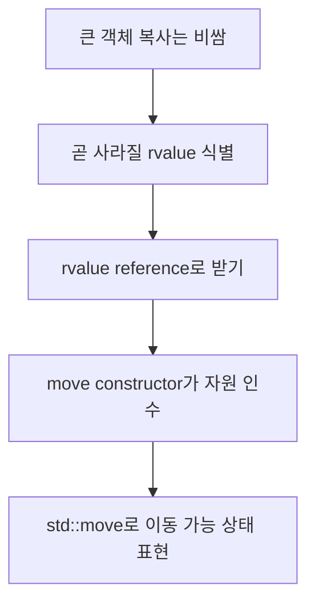

# Podcast 07 — Move Semantics: 현대 C++ 객체 관리

- [팟캐스트 링크](https://notebook.google.com/notebook/7c192b19-7039-4a6f-91df-d5fca478ffb0/artifact/05844e06-2ea0-4db9-8b58-d0502822ba2f?utm_source=nlm_web_share&utm_medium=google_oo&utm_campaign=art_share_1&utm_content=&utm_smc=nlm_web_share_google_oo_art_share_1_)

## 학습 자료

- [우측값 레퍼런스와 이동 생성자](https://modoocode.com/227)
- [Move 문법과 Perfect Forwarding](https://modoocode.com/228)

## 이번 노트의 질문

> **곧 사라질 객체가 가진 큰 자원을 굳이 새로 복사해야 할까?**



# 1. 복사의 비용

동적 배열을 가진 객체를 복사하면 새 메모리를 할당하고 모든 원소를 복제해야 한다.

```cpp
Buffer copied = original;
```

원본을 계속 사용해야 한다면 깊은 복사가 맞다. 하지만 함수가 반환한 임시 객체처럼 곧 사라질 객체라면, 그 객체가 가진 포인터만 넘겨받는 편이 훨씬 싸다.

| 복사 | 이동 |
|---|---|
| 새 자원 할당 | 기존 자원 인수 |
| 모든 데이터 복제 | 포인터·크기 등만 전달 |
| 원본 내용 유지 | 원본은 유효하지만 상태는 달라질 수 있음 |

# 2. lvalue와 rvalue

초보 단계에서는 다음처럼 구분하면 된다.

- lvalue: 이름과 지속적인 위치가 있어 이후에도 다시 사용할 객체
- rvalue: 임시값처럼 곧 사라지거나 자원을 넘겨도 되는 값

```cpp
Buffer a(1000);       // a는 lvalue
Buffer b = MakeBuffer(); // MakeBuffer() 결과는 임시 rvalue
```

`T&`는 일반적으로 lvalue를 받고, `T&&`는 rvalue를 받는다.

```cpp
void Use(Buffer& value);   // lvalue reference
void Use(Buffer&& value);  // rvalue reference
```

# 3. 이동 생성자

```cpp
class Buffer {
private:
    int* data_;
    std::size_t size_;

public:
    explicit Buffer(std::size_t size)
        : data_(new int[size]), size_(size) {}

    Buffer(const Buffer& other)
        : data_(new int[other.size_]), size_(other.size_) {
        std::copy(other.data_, other.data_ + size_, data_);
    }

    Buffer(Buffer&& other) noexcept
        : data_(other.data_), size_(other.size_) {
        other.data_ = nullptr;
        other.size_ = 0;
    }

    ~Buffer() {
        delete[] data_;
    }
};
```

이동 생성자는 `Buffer(Buffer&& other)` 형태다.

1. `other`의 자원 포인터와 크기를 가져온다.
2. `other`의 포인터를 `nullptr`로 바꾼다.
3. 두 객체가 같은 자원을 해제하는 double free를 막는다.

이동된 원본은 **유효하지만 상태는 미지정(valid but unspecified)**이라고 생각하는 것이 안전하다. 소멸하거나 새 값을 대입할 수는 있지만, 기존 내용이 남아 있다고 기대하지 않는다.

`noexcept`는 이동 과정이 예외를 던지지 않는다는 약속이다. `vector`가 재할당할 때 안전하게 이동을 선택하는 데 중요하다.

# 4. `std::move`의 정확한 역할

```cpp
Buffer a(1000);
Buffer b = std::move(a);
```

`std::move(a)`가 데이터를 직접 옮기는 것은 아니다. `a`를 rvalue처럼 취급할 수 있도록 형변환하여 이동 생성자 또는 이동 대입 연산자가 선택될 기회를 준다.

```text
std::move(a)
  → a를 이동 가능한 값으로 표현
  → Buffer(Buffer&&) 선택
  → 실제 자원 이전은 이동 생성자가 수행
```

따라서 이동 연산이 없는 타입에 `std::move`를 사용하면 복사가 일어날 수도 있다.

```cpp
const Buffer source(100);
Buffer target = std::move(source);
```

`source`가 `const`이면 이동 생성자가 원본을 수정할 수 없어 보통 복사 생성자가 선택된다. 무조건 `std::move`를 붙인다고 빨라지는 것이 아니다.

# 5. 이동 대입 연산자

이미 존재하는 객체에 다른 객체의 자원을 넘길 때는 이동 대입이 사용된다.

```cpp
Buffer& operator=(Buffer&& other) noexcept {
    if (this == &other) {
        return *this;
    }

    delete[] data_;
    data_ = other.data_;
    size_ = other.size_;

    other.data_ = nullptr;
    other.size_ = 0;
    return *this;
}
```

기존에 소유하던 자원을 먼저 정리하고 새 자원을 인수해야 한다.

# 6. Rule of Five와 Rule of Zero

자원을 직접 소유하는 클래스는 다음 다섯 함수를 함께 고려해야 한다.

1. 소멸자
2. 복사 생성자
3. 복사 대입 연산자
4. 이동 생성자
5. 이동 대입 연산자

이를 Rule of Five라고 한다. 하지만 실무에서는 `std::vector`, `std::string`, 스마트 포인터처럼 이미 자원을 안전하게 관리하는 타입을 멤버로 사용하여 다섯 함수를 직접 작성하지 않는 Rule of Zero가 더 좋은 경우가 많다.

# 7. Perfect Forwarding의 기본 목적

다른 객체를 대신 생성하는 함수는 전달받은 인자가 lvalue였는지 rvalue였는지 보존해야 한다.

```cpp
template <typename T, typename Arg>
std::unique_ptr<T> MakeObject(Arg&& arg) {
    return std::make_unique<T>(std::forward<Arg>(arg));
}
```

`std::forward`는 원래 lvalue로 들어온 인자는 lvalue로, rvalue로 들어온 인자는 rvalue로 전달한다. 처음에는 `make_unique`, `emplace_back` 같은 라이브러리가 불필요한 복사를 피하면서 생성자 인자를 전달하기 위해 쓰는 기술이라고 이해하면 충분하다.

# 8. 실무에서 이동이 보이는 곳

```cpp
std::vector<std::string> names;
std::string name = "Alice";
names.push_back(std::move(name));
```

이후 `name`의 기존 문자열 내용에 의존하면 안 된다. 반대로 아직 `name`을 사용해야 한다면 이동하지 말고 복사한다.

`emplace_back()`은 컨테이너 내부에서 객체를 직접 생성하여 임시 객체의 이동조차 줄일 수 있다.

```cpp
std::vector<std::string> names;
names.emplace_back(10, 'A');
```

# 9. 전체 흐름 정리

| 개념 | 역할 |
|---|---|
| lvalue | 계속 사용할 이름 있는 객체 |
| rvalue | 임시값 또는 자원을 넘길 수 있는 값 |
| `T&&` | rvalue를 구분해 받는 참조 |
| 이동 생성자 | 새 객체가 기존 자원을 인수 |
| `std::move` | lvalue를 이동 가능한 표현으로 형변환 |
| `std::forward` | 함수가 받은 값 범주를 보존해 전달 |

# 복습 문제

1. 큰 `std::vector<int>`를 가진 클래스에서 복사와 이동의 비용 차이를 설명하자.
2. `std::move`가 실제 이동을 수행하지 않는다는 말을 코드 흐름으로 설명하자.
3. `char*`를 소유하는 `TextBuffer`에 이동 생성자와 이동 대입 연산자를 구현하자.
4. 이동한 원본 객체를 어떤 방식으로 사용할 수 있고, 무엇을 기대하면 안 되는지 설명하자.

## 한 줄 요약

> **Move Semantics는 곧 사라지거나 포기할 객체의 자원을 복사하지 않고 인수하는 방법이며, `std::move`는 이동을 수행하지 않고 이동 연산이 선택되도록 형변환한다.**
