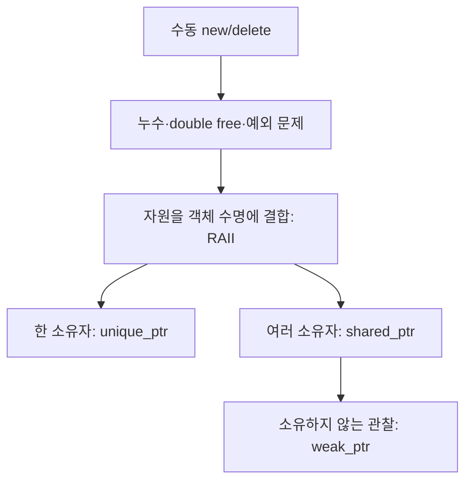

# Podcast 08 — RAII와 Smart Pointer: 현대 C++ 자원 관리

- [팟캐스트 링크](직접 입력)

## 학습 자료

- [RAII와 unique_ptr](https://modoocode.com/229)
- [shared_ptr와 weak_ptr](https://modoocode.com/252)

## 이번 노트의 질문

> **누가 자원을 해제해야 하며, 그 시점을 어떻게 보장할까?**



# 1. 수동 자원 관리의 문제

```cpp
Widget* widget = new Widget();
DoWork();
delete widget;
```

간단해 보이지만 다음 문제가 생긴다.

- 중간 반환이나 예외로 `delete`를 건너뛰면 memory leak
- 여러 포인터가 같은 주소를 각각 삭제하면 double free
- 삭제 후 포인터를 사용하면 dangling pointer
- 코드가 커지면 누가 삭제 책임을 갖는지 불명확

메모리뿐 아니라 파일, 소켓, 잠금도 획득과 반환이 정확히 짝을 이뤄야 하는 자원이다.

# 2. RAII — 자원의 수명을 객체 수명에 묶기

RAII는 Resource Acquisition Is Initialization의 약자다.

1. 생성자에서 자원을 획득한다.
2. 객체가 자원을 소유한다.
3. 소멸자에서 자원을 반환한다.

```cpp
class File {
private:
    std::FILE* handle_;

public:
    explicit File(const char* path)
        : handle_(std::fopen(path, "r")) {}

    ~File() {
        if (handle_ != nullptr) {
            std::fclose(handle_);
        }
    }
};
```

지역 객체는 정상 종료뿐 아니라 예외로 스코프를 벗어나도 소멸자가 호출된다. 그래서 해제 코드를 모든 경로에 반복하지 않아도 된다.

RAII는 메모리 전용 기술이 아니다.

| 자원 | 대표 RAII 객체 |
|---|---|
| 동적 메모리 | `vector`, `string`, 스마트 포인터 |
| 파일 | `ifstream`, `ofstream` |
| mutex 잠금 | `lock_guard` |
| 직접 만든 자원 | 생성·소멸을 관리하는 사용자 클래스 |

# 3. 소유권과 수명

스마트 포인터를 문법으로 외우기 전에 두 질문을 먼저 한다.

1. 이 객체를 누가 소유하는가?
2. 마지막 소유자가 사라질 때 객체도 사라져야 하는가?

소유권은 단순히 객체를 가리킨다는 뜻이 아니다. **객체의 파괴 시점을 책임진다**는 뜻이다.

# 4. `unique_ptr` — 단 하나의 소유자

```cpp
#include <memory>

auto widget = std::make_unique<Widget>();
widget->Run();
```

`widget`이 스코프를 벗어나면 `Widget`도 자동으로 삭제된다.

- 복사 불가
- 이동을 통한 소유권 이전 가능
- 오버헤드가 매우 작음
- 소유자가 하나라는 설계 의도가 타입에 드러남

```cpp
auto first = std::make_unique<Widget>();
// auto second = first;              // ❌ 복사 불가
auto second = std::move(first);      // ✅ 소유권 이전
```

이동 후 `first`는 일반적으로 `nullptr`이다. 실제 이동은 `unique_ptr`의 이동 생성자가 수행하고, `std::move`는 이동 생성자가 선택되도록 표현을 바꾼다.

함수 매개변수도 소유권 의도를 표현한다.

```cpp
void Observe(const Widget& widget);             // 잠깐 사용, 소유 안 함
void TakeOwnership(std::unique_ptr<Widget> p);  // 소유권을 넘겨받음
```

특별한 이유가 없다면 동적 객체의 기본 선택은 `unique_ptr`이다.

# 5. `shared_ptr` — 여러 소유자가 수명을 공유

여러 객체가 하나의 대상이 살아 있어야 할 책임을 정말로 공유한다면 `shared_ptr`를 사용한다.

```cpp
auto document = std::make_shared<Document>();
auto editor = document;
```

내부의 참조 횟수가 증가하고, 마지막 `shared_ptr`가 사라질 때 대상 객체가 파괴된다.

```text
document ─┐
          ├─> Document  (강한 참조 2개)
editor ───┘
```

장점:

- 마지막 소유자가 사라지는 시점에 자동 해제
- 여러 컴포넌트가 수명을 공동 책임하는 모델 표현

비용과 주의점:

- 참조 카운트 관리 비용
- 파괴 시점을 코드만 보고 예측하기 어려울 수 있음
- 아무 포인터에나 사용하면 소유권 설계가 흐려짐
- 순환 참조가 생기면 해제되지 않음

따라서 편하다는 이유가 아니라 **정말 공유 소유권인가**를 보고 선택한다.

# 6. `weak_ptr` — 소유하지 않는 관찰자

두 객체가 서로 `shared_ptr`로 가리키면 참조 횟수가 0이 되지 않을 수 있다.


이 순환을 끊기 위해 한쪽을 `weak_ptr`로 만든다.

```cpp
class Child;

class Parent {
public:
    std::shared_ptr<Child> child;
};

class Child {
public:
    std::weak_ptr<Parent> parent;
};
```

`weak_ptr`는 객체를 관찰하지만 참조 카운트를 늘리지 않는다. 따라서 객체 수명을 연장하지 않는다.

접근하려면 대상이 아직 살아 있는지 확인하고 임시 `shared_ptr`를 얻는다.

```cpp
if (auto parent = child.parent.lock()) {
    parent->DoWork();
}
```

`lock()`이 빈 `shared_ptr`를 반환하면 대상은 이미 소멸한 것이다.

`weak_ptr`의 용도:

- `shared_ptr` 순환 참조 해소
- 캐시나 관찰자처럼 수명을 책임지지 않는 참조
- 대상이 살아 있을 때만 접근하는 관계

# 7. 세 스마트 포인터 비교

| 타입 | 소유권 | 복사 | 객체 파괴 시점 | 대표 용도 |
|---|---|---:|---|---|
| `unique_ptr<T>` | 단독 | 불가, 이동 가능 | 유일 소유자 소멸 | 기본 동적 소유권 |
| `shared_ptr<T>` | 공유 | 가능 | 마지막 소유자 소멸 | 실제 공유 수명 |
| `weak_ptr<T>` | 소유하지 않음 | 가능 | 수명에 영향 없음 | 관찰, 순환 참조 차단 |

선택 순서:

1. 값 객체나 컨테이너 멤버로 직접 보관할 수 있는가?
2. 동적 수명이 필요하면 `unique_ptr`로 충분한가?
3. 여러 주체가 정말 수명을 공유해야 할 때만 `shared_ptr`를 쓴다.
4. 공유 대상을 소유하지 않고 바라보려면 `weak_ptr`를 쓴다.

# 8. `make_unique`와 `make_shared`

```cpp
auto user = std::make_unique<User>("Alice");
auto config = std::make_shared<Config>();
```

현대 C++에서는 다음보다 생성 함수를 우선한다.

```cpp
std::unique_ptr<User> user(new User("Alice"));
```

`make_unique`와 `make_shared`는 코드가 짧고 자원 소유권이 즉시 스마트 포인터에 연결된다. `make_shared`는 일반적으로 객체와 제어 블록을 효율적으로 함께 할당할 수 있다.

# 9. 스마트 포인터가 필요 없는 경우

모든 객체를 힙에 만들 필요는 없다.

```cpp
Widget widget;                 // 지역 값 객체
std::vector<Widget> widgets;   // 컨테이너가 객체 소유
```

값으로 보관할 수 있으면 값으로 보관하는 것이 가장 단순하다. 스마트 포인터는 동적 수명이나 다형적 소유가 필요할 때 사용한다.

소유하지 않는 접근은 상황에 따라 참조 또는 일반 포인터로 표현할 수 있다.

```cpp
void Print(const Widget& widget);  // 반드시 존재하는 비소유 접근
void Print(const Widget* widget);  // nullptr 가능 비소유 접근
```

일반 포인터를 사용한다고 항상 나쁜 것이 아니다. `new`로 얻은 자원을 일반 포인터가 직접 소유하고 `delete`까지 책임지는 구조가 위험한 것이다.

# 10. 전체 예제

```cpp
#include <iostream>
#include <memory>
#include <string>

class Document {
private:
    std::string title_;

public:
    explicit Document(std::string title) : title_(std::move(title)) {}
    ~Document() { std::cout << title_ << " destroyed\n"; }
    void Print() const { std::cout << title_ << '\n'; }
};

void Read(const Document& document) {
    document.Print();
}

int main() {
    auto owned = std::make_unique<Document>("Unique document");
    Read(*owned);

    auto shared = std::make_shared<Document>("Shared document");
    std::weak_ptr<Document> observer = shared;

    if (auto document = observer.lock()) {
        document->Print();
    }
}
```

# 11. 왜 직접 `new/delete`를 피하는가?

직접 관리하면 모든 제어 흐름에서 정확한 해제를 증명해야 한다. RAII 객체는 해제 책임을 소멸자 하나에 모은다.

```text
수동 관리: 획득 → 여러 실행 경로 → 각 경로마다 해제 필요
RAII:      객체 생성 → 어떤 경로로 나가도 소멸자가 해제
```

현대 C++의 핵심은 `delete`를 잘 쓰는 것이 아니라 **소유권을 타입으로 표현해 직접 `delete`할 일이 없도록 설계하는 것**이다.

# 복습 문제

1. memory leak과 double free가 각각 어떤 소유권 실수에서 발생하는지 설명하자.
2. `unique_ptr`를 복사할 수 없고 이동만 가능한 이유를 설명하자.
3. `shared_ptr` 순환 참조 예제를 만들고 한쪽을 `weak_ptr`로 바꿔 해결하자.
4. 다음 함수가 관찰만 하는지, 소유권을 받는지 드러나도록 매개변수 타입을 설계하자: `ProcessWidget(...)`.

## 한 줄 요약

> **RAII는 자원 수명을 객체 수명에 묶고, 스마트 포인터는 단독·공유·비소유 관계를 타입으로 표현하여 해제 책임을 자동화한다.**
